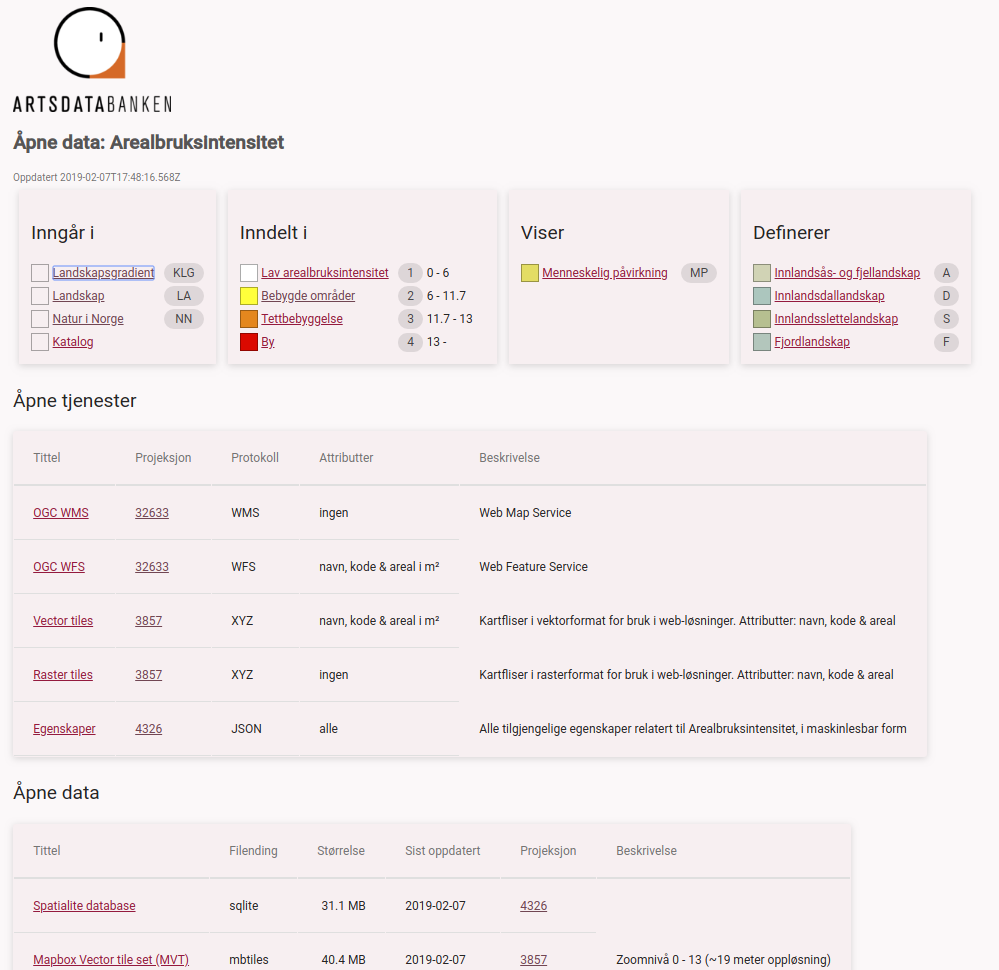

[](https://data.artsdatabanken.no/)

## 🚀 Quick start

1.  **Start developing.**

    Navigate into your new site’s directory and start it up.

    ```sh
    npm run start
    ```

1.  **Open the source code and start editing!**

    Your site is now running at `http://localhost:3333`!

## 🧐 What's inside?

A quick look at the top-level files and directories you'll see in this project.

    .
    ├── node_modules
    ├── src
    ├── .gitignore
    ├── .prettierrc
    ├── package-lock.json
    ├── package.json
    └── README.md

1.  **`/node_modules`**: This directory contains all of the modules of code that your project depends on (npm packages) are automatically installed.

2.  **`/src`**: This directory will contain all of the code related to what you will see on the front-end of your site (what you see in the browser) such as your site header or a page template. `src` is a convention for “source code”.

3.  **`.gitignore`**: This file tells git which files it should not track / not maintain a version history for.

4.  **`.prettierrc`**: This is a configuration file for [Prettier](https://prettier.io/). Prettier is a tool to help keep the formatting of your code consistent.

5.  **`package-lock.json`** (See `package.json` below, first). This is an automatically generated file based on the exact versions of your npm dependencies that were installed for your project. **(You won’t change this file directly).**

6.  **`package.json`**: A manifest file for Node.js projects, which includes things like metadata (the project’s name, author, etc). This manifest is how npm knows which packages to install for your project.

7.  **`README.md`**: A text file containing useful reference information about your project.

<!-- AUTO-GENERATED-CONTENT:END -->
